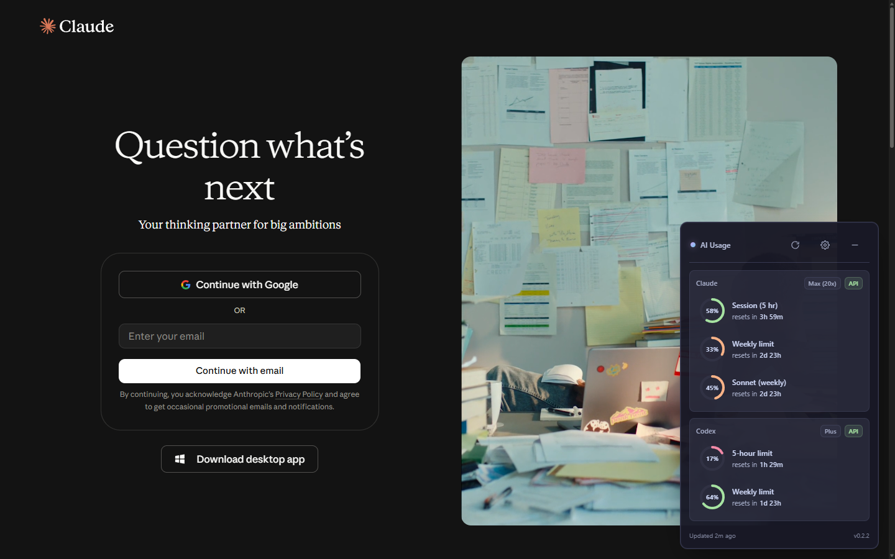
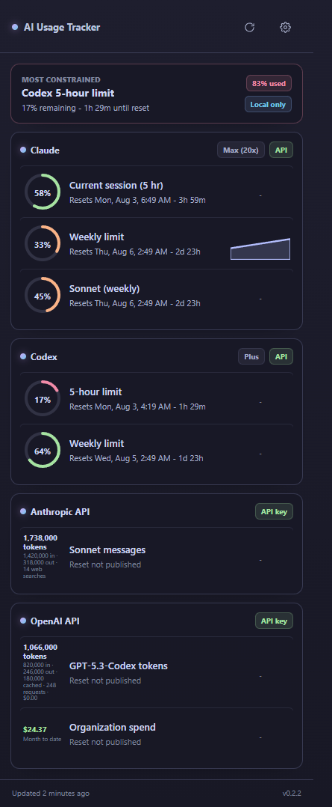
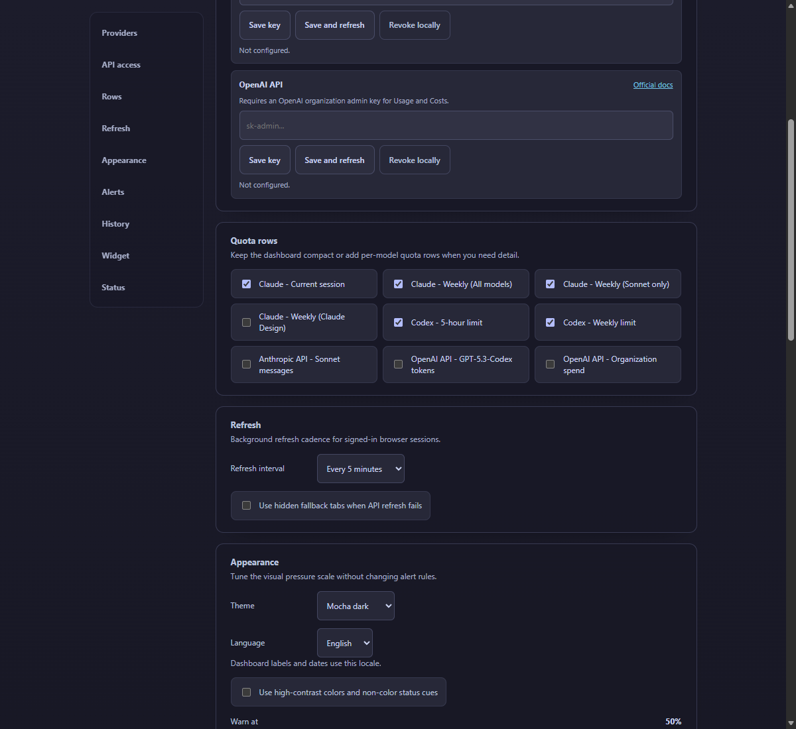
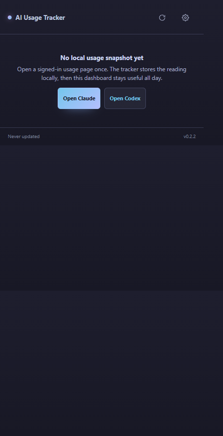
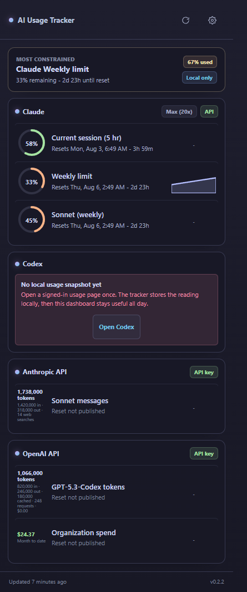
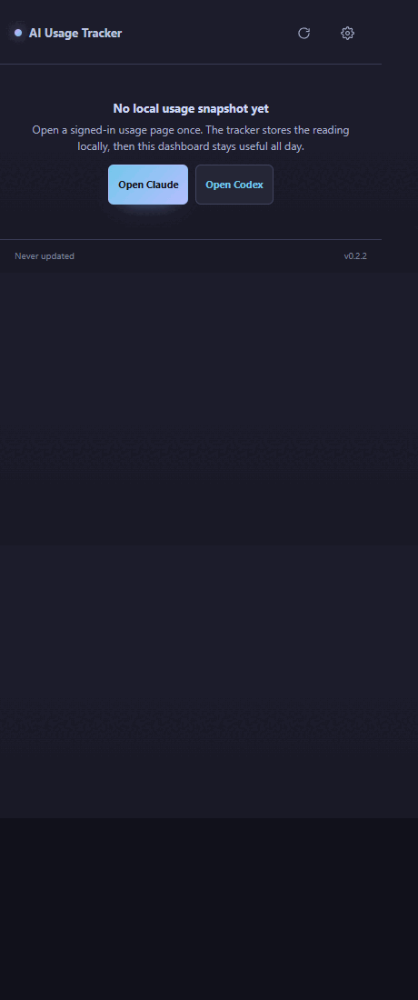

# AI Usage Tracker

[](https://github.com/SysAdminDoc/AI-Usage_Tracker/releases)
[](LICENSE)
[](#install)
[](#install)
[](#install)

Premium countdown timer + notification surface for Claude (claude.ai) and OpenAI Codex (chatgpt.com) usage limits. Always-visible glass widget on your chat tab, toolbar popup dashboard, and OS notifications when renewals or thresholds approach. Ships as a Chrome extension, Firefox extension, and Tampermonkey userscript from the same source.

## Why

Both Claude and Codex throttle you with daily and weekly quotas. The reset countdowns live on settings pages you have to navigate to. Run out unexpectedly, or waste fresh quota by not knowing it just renewed? This tells you, ambiently, all day, in your browser.

## Features

- **Always-visible widget** — drag-positionable glass card with radial-ring countdowns (HH:MM:SS center, green→amber→red ramp). Minimizes to a 32 px square corner badge; the userscript switches to a compact viewport-anchored touch layout on narrow/coarse-pointer screens.
- **Toolbar badge + popup dashboard** — rolled-up most-constrained usage percent on the extension icon, plus both providers side-by-side with recent-usage sparklines.
- **Inspectable sparklines** — hover or focus a popup sparkline to see the exact usage value and sample timestamp.
- **Pace markers** — quota rings place a secondary projected-use marker when recent history predicts the window will be exhausted, with the forecast exposed to assistive technology.
- **OS notifications** — six trigger types, each toggleable:
  - **R1 Renewal-imminent** — fires 60 min / 15 min / at-reset.
  - **R2 Renewal-arrived** — "Fresh quota — go!" the moment a bucket resets.
  - **U1 Usage-threshold** — 75% / 90% / 95% used.
  - **U2 Burn-rate forecast** — "At this pace you'll hit weekly Tuesday — 18 hrs early."
  - **U3 Spike detection** — alerts when a new sample exceeds the configurable moving-average threshold.
- **Notification preflight** — Settings shows the active notification capability and can request permission plus send a test alert before a real quota rule fires.
- **Optional webhook alerts** — notification rule events can POST directly to a configured endpoint; delivery is off by default, retries transient failures, and redacts provider/bucket details unless explicitly enabled.
- **API spend caps** — optional local session and daily caps alert at 80% and 100% of observed API spend, with a resettable session baseline and no retroactive charge for the first month-to-date sample.
- **Month-end cost forecasts** — cost-bearing API providers show a projected UTC month-end total from the current daily run rate, with coverage, official/estimated provenance, confidence, and explicit assumptions.
- **Conservative plan guidance** — after seven days of fresh cost coverage, provider-reported limits or subscription/usage-based seat mix can trigger clearly labelled higher-cap or lower-cost plan-review prompts; the tracker does not embed a volatile plan catalog.
- **D1 Daily briefing** — one calm summary at 08:00.
- Missed renewal/reset and daily-briefing alerts recover during a bounded late-refresh grace period, and the extension schedules the next exact notification deadline when one is known.
- **Per-row visibility toggles** — by default shows headline buckets only; turn on per-model rows (GPT-5.3-Codex-Spark, Sonnet only, Claude Design, etc.) in Settings.
- **API-first usage collection** — reads Claude `api/organizations/{orgId}/usage` and Codex `backend-api/wham/usage` for actual usage windows, with Claude stream/header updates and opt-in page-scraper fallback tabs.
- **Official API analytics (optional)** — the extension can store an Anthropic admin key or OpenAI organization admin key locally, then show month-to-date token usage and API cost data separately from Claude Web and Codex Web quota windows. Anthropic uses its model-aware Cost Report when available; OpenAI shows per-model estimates from a versioned local pricing table alongside the official organization Costs reconciliation total.
- **Redacted API breakdown export** — Settings groups official API rows by provider, workspace, project, shortened API-key ID, model, and cost source, then exports the same credential-free view as CSV.
- **GitHub Copilot seat activity** — optionally store a GitHub token, organization, and username locally to show the official Copilot seat plan and last activity without cookies or a relay.
- **Cursor team analytics** — optionally store a Cursor team admin API key locally to show official daily request totals and current-cycle spend with provider freshness diagnostics.
- **Gemini token analytics** — optionally store a Google Cloud monitoring OAuth token and project ID locally to show official Gemini output-token and request usage without a cloud relay.
- **OpenRouter credits and usage** — optionally store an OpenRouter key locally to show official key limits, monthly usage, remaining credits, and refresh diagnostics.
- **Provider plugin contract** — API providers use a versioned `auth` → `fetch` → `parse` → `normalize` registry seam, so new integrations can add fixture-backed adapters without expanding the service worker's dispatch table.
- **Claude context counter** — estimates the visible conversation plus draft prompt against the 200k context window and shows a compact progress bar in the widget.
- **Claude cache timer** — starts a five-minute follow-up countdown from streamed `message_limit` events, with explicit cache expiry support if Claude publishes it.
- **Claude cache reuse analytics** — keeps local 24-hour and 7-day inferred reuse ratios from successive stream observations, with explicit limits because Claude does not publish a billing-grade hit counter.
- **Polished status feedback** — clearer first-run, degraded, loading, diagnostics, and refresh states across the widget, popup, and settings.
- **Redacted support bundle** — export version, channel, permission, freshness, source, error-code, and storage evidence without history, raw errors, cookies, prompts, or full identifiers.
- **Local MCP usage server** — export an explicit redacted state file, then let a local stdio MCP process answer `get_usage`, `forecast`, and `time_to_reset` without browser storage or network access.
- **Opt-in local team dashboard** — import user-provided redacted contribution files and aggregate provider cost, token, and request totals on-device without prompts, code, credentials, project paths, or branch names by default.
- **Premium settings controls** — compact section navigation, theme selection, configurable warn/danger visual thresholds, notification snooze, and local diagnostics.
- **Locale-aware dashboard** — English, Spanish, French, and German labels plus `Intl` percent, date, and relative-time formatting; add another locale in the string table without changing render logic.
- **Rolling local history** (30-day default, configurable) with sparklines, persists across browser restart.
- **Portable history controls** — export CSV, choose retention length, compact representative samples, or clear history with an explicit confirmation.
- **Local profile manager** — create, rename, switch, and delete independent personal/work profiles with separate settings, snapshots, history, and API credentials.
- **Optional settings sync** — opt in to browser sync for display and alert preferences only; history, provider snapshots, API keys, and bridge data remain local.
- **Incognito-safe tracking** — Chromium split-incognito windows use separate local keys and show an Incognito marker; the Firefox package fails closed by keeping private windows disabled because Firefox does not support split mode.
- **Dark by default** — Catppuccin Mocha + glassmorphism. No pill backdrops.

## Product captures

The current packaged experience is shown here across the persistent widget, popup dashboard, settings/API access, first-run state, and a recoverable degraded-provider state.













## Accessibility

The widget, popup, options page, side panel, and userscript settings support keyboard focus, live reset timers, reduced-motion preferences, 44 px touch targets, and an opt-in high-contrast palette with text/pattern status cues. They share the locale catalog, use `Intl` for number/date/plural formatting, and honor Arabic RTL direction with logical layout rules. `npm test` runs the accessibility contract smoke checks, including high-contrast AA/AAA color ratios and the required live-region/focus hooks.

## Install

### Chrome / Edge / Brave / any Chromium 114+

1. Download `AI-Usage-Tracker-chrome-v0.2.3.zip` from the [Releases page](https://github.com/SysAdminDoc/AI-Usage_Tracker/releases/latest).
2. Unzip it anywhere.
3. Open `chrome://extensions`.
4. Toggle **Developer mode** on (top-right).
5. Click **Load unpacked**, pick the unzipped folder.
6. Visit claude.ai or chatgpt.com — widget appears bottom-right.

> **Why not just drag-drop the `.crx`?** Chromium 75+ rejects drag-installed self-signed CRX files (`CRX_REQUIRED_PROOF_MISSING`) regardless of developer mode. The ZIP / Load unpacked path is the supported install for self-hosted Chromium extensions.

### Firefox Developer Edition / Nightly

1. Download `ai-usage-tracker-firefox-v0.2.3.xpi` from the [Releases page](https://github.com/SysAdminDoc/AI-Usage_Tracker/releases/latest).
2. Open `about:config` → set `xpinstall.signatures.required` to `false` (DevEd/Nightly only).
3. Open `about:addons` → gear icon → **Install Add-on From File** → pick the `.xpi`.

Release Firefox does not allow unsigned extensions; a signed AMO submission is planned for a future release.

### Tampermonkey / Violentmonkey userscript

1. Install [Tampermonkey](https://www.tampermonkey.net/) or [Violentmonkey](https://violentmonkey.github.io/) in your browser.
2. Open `ai-usage-tracker.user.js` from the [Releases page](https://github.com/SysAdminDoc/AI-Usage_Tracker/releases/latest) — the userscript manager will prompt to install.
3. Visit claude.ai or chatgpt.com.

Userscript caveats vs. extension:
- No silent background refresh — data only updates while you have a Claude or ChatGPT tab open.
- Narrow or coarse-pointer userscript viewports use a compact bottom-anchored layout with no drag dependency; desktop userscript viewports retain the positionable card.
- No toolbar popup dashboard (open the in-page settings modal and history controls via the widget gear icon).
- OS notifications use the userscript manager API when available, otherwise the web `Notification` API; either path requires a provider tab to be open.
- The optional settings-sync control is extension-only; userscript data remains in the local userscript-manager store.
- Settings can request notification permission and send a test alert before you rely on a quota rule.
- Late-refresh catch-up is bounded by the open tab's next refresh; the extension's service-worker alarm path can schedule the next exact deadline.
- History persists across restart via `GM.setValue`.

Release downloads include `SHA256SUMS.txt` for verifying the Chrome ZIP, Firefox XPI, and userscript assets.

Default extension packages do not request the optional `nativeMessaging` permission. QuotaGlass users who want the local desktop mirror can build the explicitly separated bridge channel with `npm run build:bridge`; it produces `AI-Usage-Tracker-chrome-bridge-v0.2.3.zip`, `ai-usage-tracker-firefox-bridge-v0.2.3.xpi`, and `AI-Usage-Tracker-native-scheduler-v0.2.3.zip` with the companion permission and no other tracking behavior changes.

### Optional native scheduler helper

MV3 service workers and browser alarms can be delayed while a browser is asleep. The bridge build includes a dependency-free Python 3.10+ helper that keeps an opt-in native-messaging pipe open and emits a wake message for the next refresh or notification deadline. Browser alarms remain enabled as a fallback. The helper has no network or storage access and receives only `refreshMinutes` plus one `notificationAtISO` value.

To install it for the stable Chrome extension ID and the bundled Firefox ID:

```bash
unzip AI-Usage-Tracker-native-scheduler-v0.2.3.zip -d ai-usage-tracker-native-scheduler
cd ai-usage-tracker-native-scheduler
python register_scheduler_host.py --host-path /absolute/path/to/ai_usage_tracker_scheduler.py --browser all
```

On Windows, use `py -3` in place of `python` and register an executable native host path (for example, a locally built unsigned launcher for the Python helper). The registration command writes only per-user HKCU browser keys; on macOS and Linux it writes user-level `NativeMessagingHosts` manifests. Use `--dry-run` to inspect the exact allow-list before writing anything. Install the `-bridge` extension package, open Settings → Refresh, and enable **Use the local scheduler helper**. It is off by default, is not included in settings sync, and can be disabled at any time.

The bundle includes `build_scheduler_host.ps1` for a Windows host executable: run `py -3 -m PyInstaller --onefile --name ai_usage_tracker_scheduler ai_usage_tracker_scheduler.py` (or run the included script), then pass the resulting `ai_usage_tracker_scheduler.exe` to `register_scheduler_host.py`. On macOS/Linux, make the Python helper executable (`chmod +x ai_usage_tracker_scheduler.py`) and register that absolute path, or publish it with PyInstaller for a standalone host.

## Browser compatibility

| Target | Supported floor | Notes |
| --- | --- | --- |
| Chrome, Edge, Brave, and other Chromium browsers | 114+ | MV3 extension; uses local storage, alarms, notifications, tabs, side panel, runtime messaging, and split-incognito state. |
| Firefox | 115+ | MV3 extension; the manifest declares `strict_min_version` 115 and explicitly disables private-window access because Firefox does not support split mode. |
| Userscript managers | Chrome/Chromium 111+ or Firefox 115+ | Requires a modern manager with `GM.getValue`/`GM.setValue` or legacy equivalents; notification delivery also requires the manager API or page notifications. |

The release build checks this matrix against both extension manifests, userscript metadata, README copy, and the browser adapter’s API surface before packaging.

Chrome 114+ users can open **AI Usage Tracker** from the browser’s side-panel menu. The persistent panel keeps the current dashboard, local history count, provider freshness/error codes, and a link to full settings visible while the popup remains a compact glance surface.

## Permissions and data

The default extension packages use this narrow, local-first permission boundary:

| Surface | Why it is requested | What stays local |
| --- | --- | --- |
| `storage` | Save the current snapshot, settings, and rolling history | Tracker state remains in local extension storage; an explicit opt-in syncs only the settings allowlist, while Chromium incognito state uses separate prefixed keys. |
| `alarms` | Refresh the snapshot and recover notification deadlines after service-worker sleep | Alarm names and times are local browser scheduling metadata. |
| `notifications` | Show the alert rules that you enable | Notification text is derived from local snapshot state. |
| `tabs` | Open provider analytics pages and, only when explicitly enabled, a hidden fallback tab | The extension does not read arbitrary tabs or cookies. |
| `sidePanel` | Provide the optional persistent Chrome dashboard | The panel reads the same local snapshot as the popup; it adds no provider or network access. |
| `claude.ai` and `chatgpt.com` host access | Fetch or scrape usage from signed-in first-party pages | Requests stay between the extension and provider origins; no relay server is used. |
| `api.anthropic.com`, `api.openai.com`, `api.github.com`, and `api.cursor.com` host access | Optional exact-origin permissions requested only when the matching provider credential is saved or enabled | Tokens are stored in a separate local-only record; they are never included in settings or diagnostics exports. GitHub Copilot keeps its organization and username in local settings. |
| `monitoring.googleapis.com` host access | Optional exact-origin permission requested only when Gemini is configured | The token and project ID stay local; no Gemini prompts or generated content are sent through the tracker. |
| `openrouter.ai` host access | Optional exact-origin permission requested only when an OpenRouter key is configured | The key stays in the separate local-only credential record and is omitted from settings/diagnostics exports. |
| Optional webhook endpoint origin | Requested only after you enable/test a configured HTTP(S) webhook, scoped to that endpoint origin | Webhook delivery is off by default; payloads contain only rule metadata unless you explicitly include provider details. |
| `nativeMessaging` | Optional QuotaGlass mirror or local scheduler helper | Missing from default packages; the bridge profile sends either the documented redacted quota envelope or schedule metadata to a separately registered local companion, depending on the explicit setting. |

The userscript has the equivalent two-provider `@match` scope and exact first-party `@connect` declarations. It uses the page's same-origin `fetch()` path only; privileged `GM_xmlhttpRequest` cross-origin API access is not supported, and the API-key settings surface is extension-only. On a Claude page it requests only Claude data; on a ChatGPT/Codex page it requests only Codex data. It cannot refresh while no provider tab is open. No tracker path stores provider passwords, cookies, or raw prompt text. Provider snapshots may retain first-party identifiers needed for diagnostics; the optional bridge explicitly excludes account/org identifiers. The Claude context counter reads visible page text locally to estimate context usage; it does not transmit that text.

API host origins are optional in both extension manifests: an unconfigured install requests only the first-party Claude/ChatGPT origins. Saving or re-enabling a configured API provider requests its single exact API origin; revoking that provider removes the origin where the browser supports removal. Denied permission leaves the credential local but marks the provider degraded until permission is granted.

To revoke access, remove the extension or userscript from the browser. Before removal, use Settings → History → Export CSV if you want a portable history copy, then use the clear-history control. The optional QuotaGlass bridge can be excluded simply by using the default build; uninstalling the companion stops its local pipe.

## Build from source

```bash
cd ~/repos/AI-Usage_Tracker
node build/build-all.mjs
# → dist/chrome/, dist/firefox/, dist/userscript/
npm test
```

Runtime has no external services. Builds use Node 20 and the local esbuild dev dependency. `npm test` runs isolated linkedom UI permutations plus Chrome callback/Firefox promise WebExtension contract fixtures, so UI and runtime compatibility checks do not open a browser window.
For packaged-browser lifecycle coverage, run `npm run test:runtime`; it rebuilds Chrome and Firefox artifacts and exercises them with fresh isolated profiles under the invisible browser-testing contract.

The model boundary is also checked with TypeScript 7 in strict mode: provider snapshots, settings, history samples, and tracker-state guards compile before tests and release packaging.

### API provider plugins

API-key providers are registered in `src/providers/registry.js` through the versioned contract in `src/providers/plugin-api.js`. A plugin's `auth({ credential, settings, now })` phase validates local configuration and creates a request-only auth context; `fetch({ auth, settings, now, fetchImpl })` returns `{ ok, data, meta }`; `parse(data, context)` turns provider payloads into a snapshot candidate; and `normalize(snapshot, context)` enforces the shared bucket shape before storage. The credential is withheld from parse and normalize contexts, and fixture tests exercise all built-in registrations plus a secret-boundary plugin.

The host matrix is checked at test and build time: wildcard content scripts cover `claude.ai` and `chatgpt.com` subdomains, default host permissions and web-accessible resources remain apex-only, and API origins are scoped optional permissions. The userscript metadata and runtime predicates use the same two-provider contract, while its fetch path is tested for current-provider-only requests and unsupported-host no-ops. The DOM safety audit rejects direct HTML sinks in UI modules and only permits reviewed static icon markup through the guarded helper.

### Local MCP server

Use Settings → Status → **Export MCP state** to create an explicit, redacted JSON snapshot. Start the separate dependency-free server with:

```powershell
node mcp/server.mjs --state C:\path\to\ai-usage-tracker-mcp-state-2026-08-03.json
```

Configure an MCP client to launch that command over stdio. The server exposes `get_usage`, `forecast`, and `time_to_reset`; it reads only the supplied file and never opens browser storage, calls a provider, or receives API credentials. Re-export the state when a fresh reading is needed.

### Local team dashboard

Enable Settings → Team → **Enable local team dashboard** when you want to review team-provided usage. Enter a team label and member label, then use **Export redacted contribution**. A teammate can provide another contribution JSON or a ledger JSON through a channel you control; import it with **Import contribution or ledger**. Aggregation is stored in the active local profile and can be exported as a ledger JSON.

The dashboard is opt-in and file-based. It never uploads, syncs, inspects Git, or fetches team data. The contribution schema includes only user-chosen labels and aggregate official/pricing-table provider cost, token, and request totals. Prompts, code, API credentials, and project paths are omitted by construction. If **Include opt-in client, project, and Git branch labels for invoicing** is enabled, those manually entered labels are added to the contribution and can be exported as **Invoicing CSV**; otherwise they are omitted. A self-hosted or user-provided process can transport or merge the JSON without becoming part of this extension.

## Comparison and FAQ

| Product | Strong fit | Honest tradeoff |
| --- | --- | --- |
| AI Usage Tracker | Browser-first Claude + Codex quota windows, optional official Anthropic/OpenAI API analytics, local history, reset/threshold alerts, and an optional userscript | It intentionally keeps API analytics local and does not provide cloud sync or team reporting. |
| [Claude Counter](https://github.com/she-llac/claude-counter) | Lightweight Claude bars, reset countdowns, cache timing, and streamed usage | Primarily Claude-focused; page/API schema drift still needs maintenance in any tracker. |
| [Claude Usage Extension](https://github.com/lugia19/Claude-Usage-Extension) | Broad Claude accounting, tokenizer/API estimates, and wider distribution materials | Its broader accounting surface is a different privacy and complexity tradeoff from this tracker’s quota-window focus. |
| [CodexBar](https://github.com/steipete/CodexBar) | Multi-provider status and desktop/menu-bar diagnostics | A desktop-first workflow is better for system-wide status; this project stays in the browser where provider sessions already exist. |
| [OpenUsage](https://github.com/janekbaraniewski/openusage) | Provider breadth, local dashboard, exports, metrics, and spend views | A local daemon/database and wider integration surface are more operational overhead than this extension currently assumes. |
| Tokens 4 Breakfast / TokenWatch / WakaTime AI | Budgets, forecasting, attribution, and commercial cost intelligence | Those capabilities generally require API-cost data, project metadata, or a different cloud/team privacy model. |

### FAQ

**Does the tracker upload prompts or usage data?** No. The default build has no telemetry or remote relay. It makes first-party requests to Claude/ChatGPT using the browser session, then stores normalized state locally. The optional bridge is a separate local native-messaging build and receives only its documented redacted display envelope.

**Does it save API keys?** The extension can save optional Anthropic and OpenAI organization admin keys, a GitHub token for Copilot seat activity, a Cursor team admin API key, a Google Cloud monitoring OAuth token for Gemini, or an OpenRouter key in a separate local-only storage record. The values are never displayed again and are omitted from settings/diagnostics exports. Treat browser extension storage as convenient local storage, not a password vault; revoke the credential at the provider when you no longer need it.

**What does the API analytics section show?** Anthropic shows month-to-date token totals grouped by model/workspace plus official model-aware Cost Report totals when the admin key can read them. OpenAI shows completion token totals grouped by model/project/API-key ID, a versioned local pricing estimate beside each known model, and the official Costs response grouped by project/API-key ID for reconciliation. Unknown models stay token-only rather than receiving a guessed price. GitHub Copilot shows the configured organization member's official seat plan and most recent activity. Cursor shows official team daily request totals and current-cycle spend. Gemini shows month-to-date output-token and request-quota usage from Google Cloud Monitoring for the configured project. Gemini API keys alone do not expose historical usage through the public API, so Gemini uses a monitoring OAuth token for this view. OpenRouter shows the configured key's monthly usage/limit plus account credits when the key has management access. These are provider metrics, not the flat subscription quota rings for Claude Web or Codex Web.

**How is the API breakdown kept safe?** The provider APIs group rows by workspace, project, and API-key ID where available. Settings shows shortened identifiers and the CSV export uses the same redaction; credential values are stored separately and never enter the snapshot, UI, diagnostics, or export.

**How does the local MCP server get data?** Export MCP state from Settings → Status, then pass that file explicitly to `node mcp/server.mjs --state <file>`. The server is a local stdio process over a static redacted snapshot; it does not read extension storage, access the network, or reconstruct missed refreshes. Re-export after refreshing the extension.

**How does team mode share data?** It does not share data automatically. Enable the local dashboard, export a redacted contribution, and import user-provided contribution or ledger JSON files on the device where you want aggregation. Only aggregate provider cost, token, and request totals plus labels are accepted; prompts, code, credentials, and paths are not part of the base schema. Manual client/project/branch labels require a separate explicit opt-in and are available in the invoicing CSV; the browser build does not inspect local Git repositories.

**How does the month-end cost forecast work?** The popup and Settings → Forecast project each cost-bearing API provider's month-to-date total through the end of the current UTC month using a straight-line daily run rate. Official provider totals receive higher confidence than pricing-table estimates; stale snapshots and short coverage are explicitly downgraded, and the UI lists the assumptions. A provider needs more than one full day of observed cost coverage before it receives a numeric projection. The forecast is local and does not reconstruct spend during missed refreshes.

**How does plan guidance work?** Settings → Forecast and the popup can show a plan-review prompt only after seven days of fresh cost coverage. It uses a provider-reported limit, or Cursor's reported included-versus-usage-based request mix, to flag a possible higher-cap or lower-cost review. It does not know current plan names, prices, entitlements, or terms, so every prompt carries an uncertainty label and should be verified against the provider before acting.

**How do webhook alerts work?** Settings → Notifications keeps webhook delivery off until you enable it and grant the configured endpoint origin. Rule events use bounded retries for transient failures; the default payload contains the event schema, rule ID, tone, and catch-up flag, while provider, bucket, percentage, reset, title, and body details require the separate opt-in. The endpoint URL and delivery status stay local and are not included in diagnostics.

**How is Claude cache reuse measured?** Each streamed `message_limit` observation is recorded locally. If it arrives before the previous locally observed five-minute expiry, it counts as an inferred reuse; the popup and widget show rolling 24-hour and 7-day ratios. This is not a provider-reported hit/miss or billing metric, and missed refreshes cannot be reconstructed.

**How do API spend caps work?** Settings → Notifications can track observed increases in cumulative Anthropic, OpenAI, Cursor, or OpenRouter API spend for the current local session and calendar day. The first observed total is a baseline rather than a retroactive charge; provider counter resets are handled as new spend, and missed refreshes cannot be reconstructed. Caps remain off when their value is blank or zero, and alerts fire at 80% and 100%.

**Why is Firefox installation different?** The downloadable XPI is unsigned for self-hosted development. Firefox Release requires a signed store channel; Developer Edition/Nightly can use the documented development setting.

**What happens when a provider changes its page or endpoint?** The dashboard keeps the last known state with source/freshness/error diagnostics, and the contract tests cover representative API, stream, header, DOM, and failure shapes. A stale value is not presented as a fresh reading.

**Can I use it without a provider tab open?** The extension can use its authenticated API path and service-worker alarms. The userscript requires an open Claude or ChatGPT tab for refresh and browser notifications.

**How do local profiles work?** Open Settings → Profiles to create or switch profiles. Each profile stays in local browser/userscript storage and keeps its own settings, quota snapshot, history, and API credentials. Deleting a profile removes that profile's local records; one profile must always remain.

**What happens in an incognito window?** Chromium split-incognito windows get an independent Default/profile registry, state, history, and API-key namespace, and the widget/popup label the context “Incognito.” The Firefox package does not run in private windows because its platform cannot provide the same split behavior.

**What does settings sync include?** Only display, locale, row-visibility, refresh, retention, threshold, and notification-rule preferences for the active profile. It never syncs history, quota/provider snapshots, API keys, credentials, bridge configuration, or native scheduler configuration, and it is off by default.

**How do I disable background page fallback?** It is off by default. If enabled for a debugging case, turn off “Use hidden fallback tabs when API refresh fails” in Settings; the extension does not silently enable it.

**What should I attach to a support report?** Use Status → Export redacted bundle. It omits history and raw provider errors; still inspect the JSON once before sharing it outside your trusted support channel.

## Privacy

- The default package sends no tracker data to analytics, telemetry, or remote relay servers. The optional bridge sends only its redacted display envelope to the locally installed QuotaGlass companion.
- All scraping is against your own logged-in session on `claude.ai` and `chatgpt.com`.
- History stored locally in `chrome.storage.local` (extension) or `GM.setValue` (userscript).
- Source is auditable — open the built files and read them; they are not minified.

## License

MIT — see [LICENSE](LICENSE).
